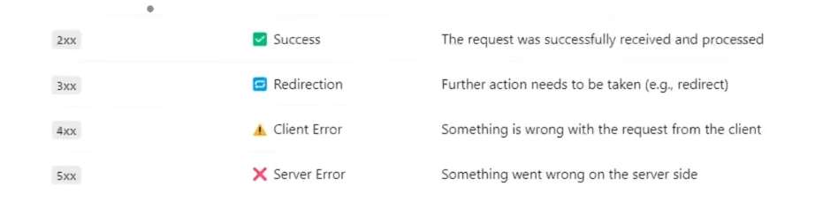
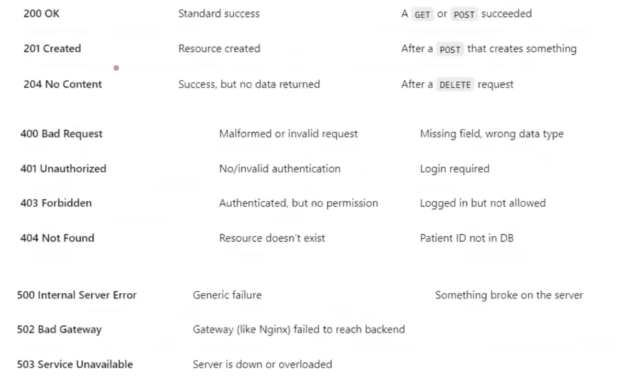

# FastAPI — Day 03: Path Parameters, Query Parameters & Status Codes

## 1. Path Parameters

Path parameters are **dynamic segments embedded in the URL** used to identify a specific resource.

```
GET /patient/P01
              └── path parameter: patient_id = "P01"
```

**When to use:** Retrieving, updating, or deleting a single, specific record.

### Basic Implementation

```python
@app.get("/patient/{patient_id}")
def get_patient(patient_id: str):
    data = load_data()
    if patient_id not in data:
        raise HTTPException(status_code=404, detail="Patient not found")
    return data[patient_id]
```

FastAPI reads the `{patient_id}` segment from the route and injects it as a function argument — with automatic type coercion.

### `Path()` Function

For metadata, documentation hints, and validation on path parameters, use the `Path` function from FastAPI:

```python
from fastapi import FastAPI, Path, HTTPException

@app.get("/patient/{patient_id}")
def get_patient(patient_id: str = Path(..., description="ID of the patient", example="P01")):
    data = load_data()
    if patient_id not in data:
        raise HTTPException(status_code=404, detail="Patient not found")
    return data[patient_id]
```

- `...` means the parameter is **required** (no default)
- `description` and `example` appear in the `/docs` Swagger UI automatically

---

## 2. HTTP Status Codes

Returning the right status code is part of the API contract — clients rely on these to understand what happened.

| Code | Meaning | When to Use |
|---|---|---|
| `200 OK` | Success | Request processed, data returned |
| `400 Bad Request` | Client error | Wrong data type or malformed request |
| `404 Not Found` | Resource missing | Requested ID does not exist |


### Using `HTTPException`

Instead of returning raw JSON for errors, raise an `HTTPException` with the appropriate status code:

```python
from fastapi import HTTPException

raise HTTPException(status_code=404, detail="Patient not found")
```

This ensures the response has the correct HTTP status — not just `200 OK` with an error message buried in the body, which would be misleading to clients.

---

## 3. Query Parameters

Query parameters are **optional key-value pairs** appended to the URL after `?`, separated by `&`.

```
GET /sort?sort_by=height&order=descending
          └── key=value pairs, not part of the path
```

**When to use:** Sorting, filtering, searching, or pagination — operations that don't identify a specific resource but modify how a collection is returned.

### Basic Implementation

Any function parameter that is **not** part of the route path is automatically treated as a query parameter by FastAPI:

```python
@app.get("/sort")
def sort_patients(sort_by: str = "height", order: str = "ascending"):
    data = load_data()
    # sorting logic here
    return sorted_data
```

### `Query()` Function

Use the `Query` function for defaults, validation, and documentation:

```python
from fastapi import Query

@app.get("/sort")
def sort_patients(
    sort_by: str = Query("height", description="Field to sort by: height or weight"),
    order: str = Query("ascending", description="Sort order: ascending or descending")
):
    valid_fields = ["height", "weight"]
    if sort_by not in valid_fields:
        raise HTTPException(status_code=400, detail=f"Invalid field '{sort_by}'. Choose from {valid_fields}")

    data = load_data()
    sorted_data = sorted(data.values(), key=lambda x: x[sort_by], reverse=(order == "descending"))
    return sorted_data
```

---

## 4. Path vs Query Parameters — When to Use Which

```
/patient/{patient_id}?sort_by=height&order=descending
          └─────────┘  └───────────────────────────┘
         Path Param           Query Params
     (identifies resource)  (modifies the response)
```

| | Path Parameter | Query Parameter |
|---|---|---|
| **Position** | Inside the URL path | After `?` in the URL |
| **Required?** | Always required | Usually optional (can have defaults) |
| **Use case** | Identify a specific resource | Filter, sort, paginate a collection |
| **FastAPI definition** | `{param}` in route + `Path()` | Function arg not in route + `Query()` |

---

## Key Takeaways

- Path parameters identify **which** resource; query parameters control **how** it is returned.
- Always raise `HTTPException` with the correct status code — never bury errors inside a `200 OK` response.
- Both `Path()` and `Query()` serve two purposes: runtime validation and auto-documentation in `/docs`. Use them consistently.
- Validating query inputs explicitly (e.g., checking `sort_by` against an allowed list) is a best practice — it prevents silent failures and gives clients clear error messages.

---

*Next: POST, PUT, DELETE endpoints + Pydantic models for request body validation →*